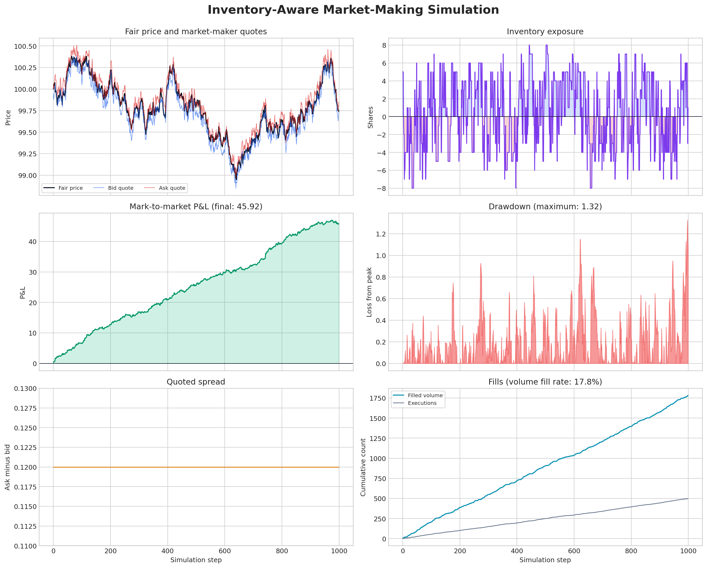
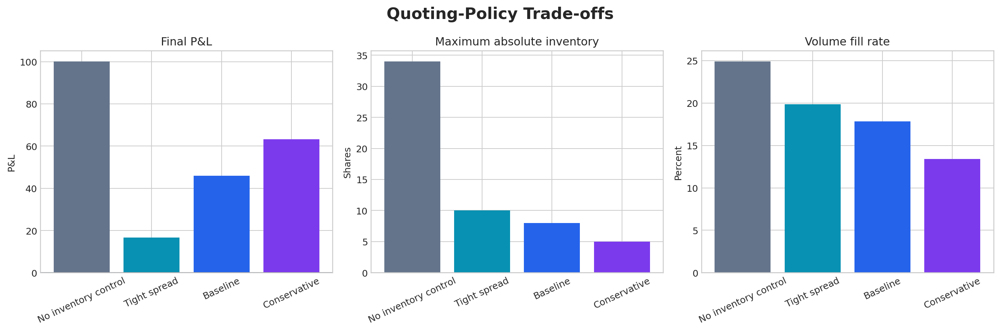
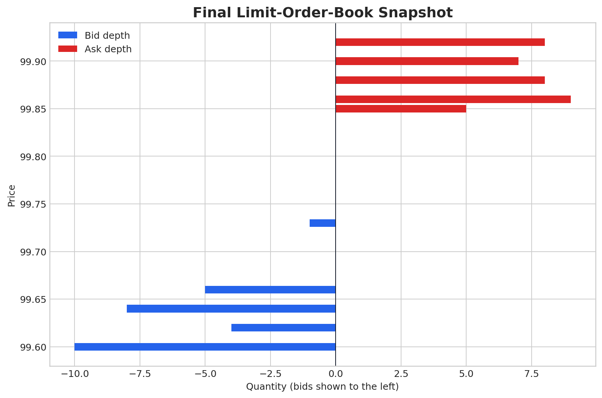

# Market-Making & Limit-Order-Book Simulator

An educational Python simulator that builds a miniature exchange, matches
orders using **price-time priority**, and tests an **inventory-aware market
maker** against simulated order flow.

The project connects market microstructure theory to a complete research
workflow: exchange mechanics, strategy logic, risk controls, performance
measurement, visualisation, tests, and a reproducible experiment.

> This is a simplified educational model. It is not a live trading system and
> its simulated returns should not be interpreted as achievable market returns.

## Headline result

The default 1,000-step experiment uses seed `42`, so it can be reproduced
exactly.

| Metric | Result |
|---|---:|
| Total mark-to-market P&L | £45.92 |
| Market-maker executions | 498 |
| Filled volume | 1,783 shares |
| Volume fill rate | 17.83% |
| Average quoted spread | £0.12 |
| Maximum absolute inventory | 8 shares |
| Maximum drawdown | £1.32 |
| Final inventory | 1 share |



## What the project implements

### Exchange engine

- Limit orders, market orders, and cancellations
- Separate bid and ask books
- Best-price-first matching
- FIFO priority at an equal price
- Partial fills and multi-level execution
- Trade records and aggregated book depth

### Market-making strategy

At every step, the market maker places one bid and one ask around an adjusted
centre:

```text
adjusted centre = fair price - inventory skew × inventory
bid quote       = adjusted centre - half-spread
ask quote       = adjusted centre + half-spread
```

Positive inventory moves both quotes down, making further purchases less
attractive and sales more attractive. Negative inventory moves both quotes up.
The strategy also stops quoting the risky side if the inventory limit is
reached.

### Simulation environment

- Random fair-price changes
- Multi-level background liquidity
- Random external market orders
- Informed order flow that creates adverse selection
- Per-share transaction fees
- Quote cancellation and replacement
- Reproducible random seeds

### Performance analysis

- Cash, inventory, wealth, and P&L
- Real-time mark-to-market valuation
- Trade count and filled volume
- Volume and quote-order fill rates
- Average spread
- Maximum inventory
- Inventory volatility
- Maximum drawdown
- Comparison of four quoting policies

## Price-time priority example

Suppose the sell side contains:

| Seller | Price | Quantity | Arrival |
|---|---:|---:|---:|
| B | £100.05 | 8 | Second |
| A | £100.10 | 5 | First |

A market buy for 10 shares receives:

1. 8 shares from Seller B at £100.05 because it is the better price.
2. 2 shares from Seller A at £100.10.
3. Seller A's remaining 3 shares stay in the book.

If two sellers quote the same price, the one submitted first trades first.

## Strategy trade-off



The no-inventory-control policy earns the highest P&L in this particular seeded
simulation, but reaches 34 shares of absolute inventory. The baseline earns less
while limiting maximum absolute inventory to 8 shares. This demonstrates the
central market-making trade-off: spread capture must be considered alongside
inventory risk, not in isolation.

## Final order-book snapshot



Blue bars show aggregated bids and red bars show aggregated asks. Bid depth is
plotted to the left only to make the two sides visually distinct.

## Repository structure

```text
market-making-lob-simulator/
├── market_making_lob_simulator.ipynb  # Guided, runnable walkthrough
├── simulator.py                       # Exchange and strategy implementation
├── README.md                          # Project explanation and results
├── requirements.txt                   # Python dependencies
├── tests/
│   └── test_order_book.py             # Six deterministic tests
└── results/
    ├── simulation_dashboard.png
    ├── order_book_snapshot.png
    ├── strategy_comparison.png
    ├── simulation_history.csv
    ├── summary_metrics.csv
    └── strategy_comparison.csv
```

## Run the project

### Option 1: Jupyter or Google Colab

Open `market_making_lob_simulator.ipynb` and run all cells from top to bottom.
The notebook is self-contained.

### Option 2: Python

```bash
python -m pip install -r requirements.txt
python simulator.py
```

This regenerates the CSV files and charts inside `results/`.

### Run the tests

```bash
python -m unittest discover -s tests -v
```

The tests verify:

1. Better prices execute first.
2. FIFO applies at the same price.
3. Partial fills leave the correct remainder.
4. Cancellations remove resting orders.
5. Market-order remainders do not rest.
6. Strategy wealth obeys `cash + inventory × fair price`.

## Important modelling choices

- A simulated fair price is used to mark inventory to market.
- The order book is refreshed each step to model quote cancellation and
  replacement.
- The market maker uses passive, post-only quotes.
- Informed order flow moves fair value in the taker's direction, creating
  adverse selection.
- Fill rate means executed quote volume divided by submitted quote volume.
- P&L includes per-share fees and the unrealised value of final inventory.

## Limitations and possible extensions

Real electronic markets are considerably more complex. A stronger future
version could add:

- Event-by-event persistent background orders and cancellations
- Variable latency and queue position
- Empirically calibrated order-arrival intensity
- Volatility-dependent spreads
- Maker rebates and taker fees
- Several competing market makers
- Historical limit-order-book data
- An Avellaneda–Stoikov quoting benchmark

## Interview summary

> I built a price-time-priority limit-order-book engine and used it to test an
> inventory-aware market maker. The engine handles limit orders, market orders,
> cancellations, FIFO queues, and partial fills. The strategy shifts its bid and
> ask based on inventory, records every execution, and marks cash plus inventory
> to the simulated fair price. I then compared quoting policies and showed that
> higher simulated P&L can come with materially greater inventory exposure.
